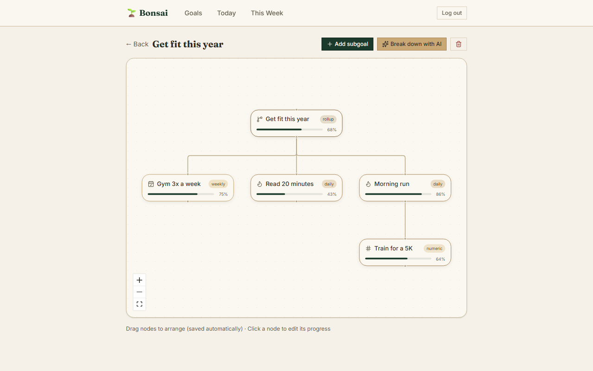
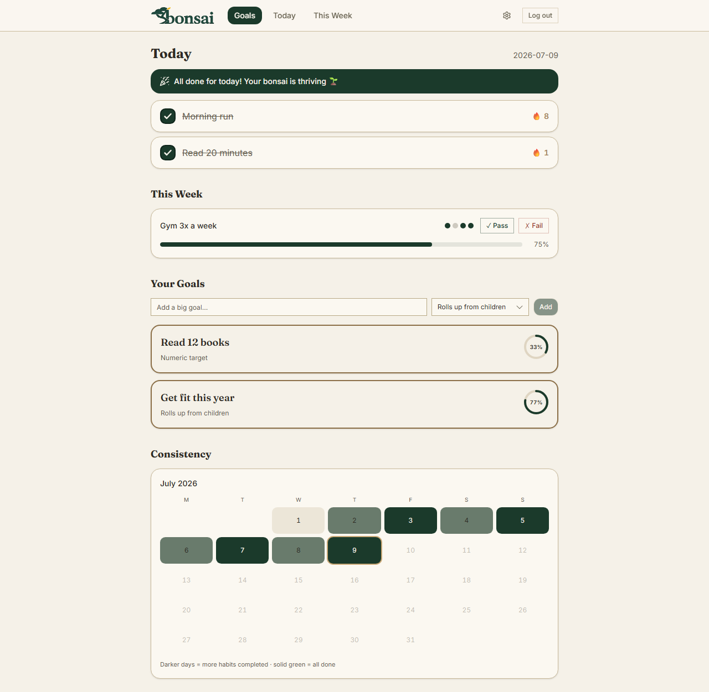
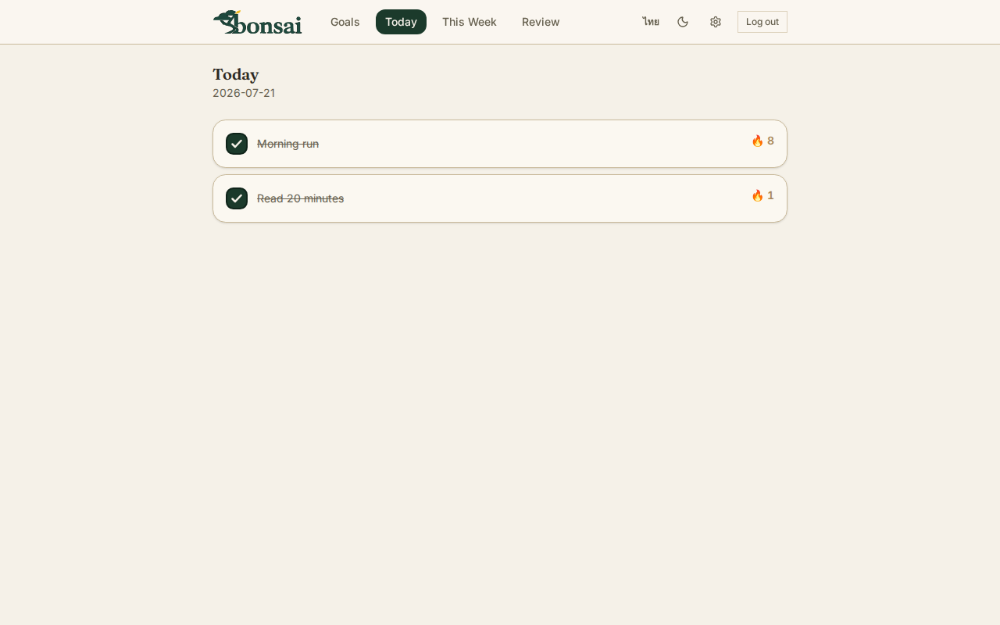

# 🌱 Bonsai

A hierarchical goal tracker that breaks big goals into a draggable node graph, down to daily habits and weekly commitments — with progress that rolls up automatically.



| Dashboard | Today |
|---|---|
|  |  |

## Why I built this

Most goal apps store goals as a flat list, but real goals are trees: "get fit this year" only means something once it's broken into "run daily" and "gym 3× a week". I wanted the tree to be *visible* — a canvas you can drag around, not an indented list — and I wanted the parent's progress to be computed from its children instead of guessed. It's also my playground for shipping a full .NET + React stack end to end.

## Tech stack

| Layer | Technologies |
|---|---|
| Backend | .NET 10 minimal API, MongoDB, JWT auth (BCrypt), Google Sign-In (ID-token flow), ASP.NET Data Protection (key ring in Mongo), built-in rate limiting |
| Frontend | React 19, TypeScript, Vite, Tailwind CSS v4, shadcn/ui, TanStack Query, React Flow (@xyflow/react), dark mode, EN/TH i18n, installable PWA |
| AI | BYOK — Anthropic, OpenAI, or Gemini via a provider abstraction, all with structured outputs |
| Testing | xUnit (backend), Playwright scripts (browser E2E) |
| DevOps | Docker Compose (mongo + api + nginx web), GitHub Actions CI (backend tests, frontend build, and a Playwright E2E job that boots the full stack) |

## Features

- **7 progress-tracking types** — stages, numeric target, checklist, manual %, daily habit, weekly commitment, and rollup (parent = average of children), each with its own inline editor; a goal's type can be switched later from its panel in the graph view
- **"Mark as success" on a rollup goal** — force a big goal's own progress to 100% regardless of what its sub-goals say, without touching them: they stay exactly as they were, tracked independently, and un-marking reverts the parent to the real computed average. It also quietly drops that goal's daily habits and weekly commitments from Today/This Week/the dashboard To Do list — the goals themselves aren't touched (still visible, still their real status, if you open the tree), they just stop asking to be checked off once you've called the whole branch done
- **Draggable node-graph view** of each goal tree (React Flow) with Dagre auto-layout for new nodes; dragged positions persist through a dedicated `PATCH /goals/{id}/position` endpoint so canvas drags can't race progress edits
- **Daily habit check-ins with streak tracking** — streak survives an unchecked *today*, breaks on a real gap
- **Consistency calendar heatmap** — each day of the current month shaded by the fraction of habits completed
- **Weekly pass/fail commitments** — one result per goal per ISO week (upserted), progress = pass rate over the last 4 recorded weeks
- **Dashboard "To Do" section** — active stages/numeric/checklist/manual goals from every level of every tree, each with its inline editor, so one-off work is actionable without opening each goal's graph; goal cards and graph nodes also show a type-specific data peek (4/12 books, 2/3 steps, subgoal count) instead of only a percentage
- **AI goal breakdown (bring your own key)** — one click turns a vague goal into a subtree whose depth *and progress types* the model chooses to fit each piece of work: habit branches bottom out in a weekly commitment backed by daily habits, one-off work becomes stages (with real step titles) or a numeric target (with amount + unit) instead of a fake recurring habit. Every node gets a concrete "how to do it" description, and breaking down a goal whose type can't aggregate children auto-promotes it to rollup so its progress actually moves. Works with an Anthropic, OpenAI, or Gemini key configured in Settings
- **AI sub-breakdown on any existing node** (rollup/weekly only) — add children under a goal deep inside an already-built tree without touching anything else in it; the prompt is told the node's ancestor path and its current children so it doesn't recreate what's already there, and nothing is written until you review a preview and confirm. Full-tree "Break down with AI" is reserved for goals that are still blank — once a goal has children the button disables itself (and the server backs that up with a 409) so the two flows can never pile duplicate subtrees onto each other
- **Goal descriptions** — an optional "how to do this" note on any goal: shown under each habit right where you check it off, as a hover tooltip on graph nodes, and prefilled from AI suggestions
- **Weekly streaks + AI-assisted "what's next"** — after logging a pass/fail, a rule-based layer picks a direction (harder / same / retry / easier) from recent results and daily-checkin rate; if the user has an LLM key, it fleshes that out into a concrete titled suggestion with a one-line reason. Accept it, tweak the title, or dismiss it — every outcome is logged for later tuning
- **Progress history + sparkline** — a daily snapshot of every goal's computed progress is kept, so each goal detail page can chart its trend over the last N days instead of only showing the current number
- **In-app weekly review digest** (`/review`) — a single "how did this week go" page: which weekly commitments were recorded/passed and their streak, and how many days each daily habit was checked off, with a shareable weekOf/today window driven by the client's local dates
- **One-click demo mode** — a shared demo account with a fully seeded goal tree (live streaks, weekly history, colored heatmap), guarded against destructive requests and reseeded hourly
- **Auth options** — email/password, Google Sign-In (Google Identity Services ID-token flow, no client secret), or the demo account
- **Archive & restore** — soft-delete any goal from the graph view and bring it back from the dashboard; hard delete still cascades the whole subtree
- **Dark mode + English/Thai UI** — both toggles live in the nav bar and persist
- **Timezone-correct tracking** — the client sends its local date, so a check-in at 11 pm in Bangkok lands on the right day
- **Account management** — change password (Google-only accounts can set one), full JSON data export, delete account with full data wipe
- **Per-user data isolation** on every endpoint; rate limiting on auth and AI routes; subtree delete cascades to check-ins and weekly attempts

## Architecture

**Goal tree in MongoDB.** Each goal stores both `parentId` and an `ancestors` array (all ids from root to parent). `parentId` gives cheap child listing; `ancestors` makes "fetch/delete an entire subtree" a single indexed query (`ancestors: goalId`) with no recursion.

**Time-series data lives in separate collections.** Check-ins (`userId + goalId + date`, unique) and weekly attempts (`userId + goalId + weekOf`, unique) are their own collections rather than arrays embedded in the goal document — unbounded growth stays out of the hot document, and the unique indexes make check-in toggles and weekly results idempotent upserts. Progress snapshots (`userId + goalId + date`, one per day) and suggestion events (what the user did with a next-goal suggestion) follow the same pattern.

**Progress is computed, not stored as truth.** [`ProgressCalculator.cs`](api/Bonsai.Api/Services/ProgressCalculator.cs) is a pure static class (no I/O) with the math for all 7 types plus weekly/daily streaks; [`ProgressService.cs`](api/Bonsai.Api/Services/ProgressService.cs) loads a user's goals and evaluates deepest-first so rollup parents always see already-computed children, then upserts a daily progress snapshot per goal for the trend chart. One override sits on top of all of it: `ProgressCalculator.Effective(status, computed)` forces a goal marked "done" to read 100% no matter what its type computed — the "Mark as success" button on a rollup goal — without ever writing to its children, so it composes correctly up the tree and reverts cleanly on undo.

**"Suggest next" is two decoupled layers.** [`WeeklySuggestionCalculator.cs`](api/Bonsai.Api/Services/WeeklySuggestionCalculator.cs) is a pure, unit-tested rule (harder/same/retry/easier from recent pass/fail + checkin rate) that always returns an answer; an optional LLM layer behind [`BreakdownService.SuggestNextWeeklyAsync`](api/Bonsai.Api/Services/BreakdownService.cs) turns that direction into a concrete titled suggestion and degrades silently to the rule-only response on any failure or missing key.

**API keys are encrypted at rest.** BYOK keys are validated with a live test request, encrypted with ASP.NET Data Protection before storage, and only their last 4 characters are ever returned to the client. Keys never appear in logs, and the Data Protection key ring itself is persisted in MongoDB so encrypted keys survive container rebuilds and multi-instance deploys.

## Testing

125 xUnit tests — pure-logic tests plus 7 `[SkippableFact]` integration tests that boot the real app against Mongo (and skip, not fail, when none is reachable):

- progress math for all 7 types in [`ProgressCalculatorTests.cs`](api/Bonsai.Api.Tests/ProgressCalculatorTests.cs) — divide-by-zero and negative-target guards on numeric goals, empty/null collections for every type, archived children excluded from checklist/rollup averages, the "done always reads 100%" override passing every other status through unchanged, and the done-ancestor check that hides a goal from Today/This Week regardless of how many levels up the "done" sits
- daily and weekly streak edge cases in [`WeeklyStreakTests.cs`](api/Bonsai.Api.Tests/WeeklyStreakTests.cs) — unchecked *today* doesn't break a daily streak, a mid-run gap does; weekly streak counts consecutive passes newest-first and stops at the first fail
- the "suggest next weekly goal" direction rule in [`WeeklySuggestionCalculatorTests.cs`](api/Bonsai.Api.Tests/WeeklySuggestionCalculatorTests.cs) — two fails in a row → easier, a lone fail → retry, a comfortable pass → harder, a strained pass → same
- AI flat-list → tree conversion in [`BreakdownTreeBuilderTests.cs`](api/Bonsai.Api.Tests/BreakdownTreeBuilderTests.cs) — 2-level and 6-level builds with parents-first ordering and correct ancestor chains; a target node that's already deep in an existing tree gets its *own* ancestor chain extended, not a fresh one (the sub-breakdown case); stage/numeric payloads materialised only on their own type; responses with or without optional fields both parse; rejection (typed exception, no crash) of cycles, unknown/self/duplicate parent references, multiple roots, and >6-level depth
- sub-breakdown prompt context in [`SubBreakdownPromptTests.cs`](api/Bonsai.Api.Tests/SubBreakdownPromptTests.cs) — ancestor path, node description, existing-children dedup warning, and user instruction are each included only when present
- full-stack smoke checks in [`ApiIntegrationTests.cs`](api/Bonsai.Api.Tests/ApiIntegrationTests.cs) via `WebApplicationFactory<Program>` against a throwaway database — including that breaking down a goal that already has children returns 409 and inserts nothing, that marking a rollup "done" shows 100% while its unfinished child keeps its own real progress and status, and that doing so also drops that child from `/today`/`/goals/this-week` (restored on undo) without deleting or archiving it

Separating the math into pure classes keeps almost all of these tests free of MongoDB mocks. CI runs them on every push, builds the frontend, and then boots the whole Docker Compose stack to run a Playwright browser smoke test against it. The local `web/e2e-*.mjs` scripts cover more flows, including a regression test that drags a node, clicks empty canvas, and asserts zero position drift.

The three screenshots at the top of this README are themselves CI output: after `e2e` passes on a push to `main`/`master`, a `screenshots` job seeds a fresh account (dates computed relative to "today", never hardcoded), captures the dashboard/today/graph views with Playwright, and commits any changed PNGs straight back to the branch — so they never drift from the current UI. See [`web/e2e-readme-screenshots.mjs`](web/e2e-readme-screenshots.mjs) and the `screenshots` job in [`.github/workflows/ci.yml`](.github/workflows/ci.yml).

## AI integration (BYOK)

`POST /goals/breakdown` asks an LLM to split a goal into a tree whose **depth and progress types the model chooses** (capped at 6 levels) based on the goal's real complexity: habit-building branches end in weekly + daily nodes, one-off work becomes stages or a numeric target rather than a fake recurring habit. The structured output is a *flat* item list — `{ tempId, parentTempId, title, description, progressType, weeklyTarget?, stages?, numericTarget?, numericUnit? }` — which sidesteps the no-recursive-schema limitation of every provider's structured-output mode, and carries enough payload that stages/numeric goals are trackable the moment they're created (step titles, target + unit) instead of sitting at 0%. [`BreakdownTreeBuilder.cs`](api/Bonsai.Api/Services/Llm/BreakdownTreeBuilder.cs) (pure, unit-tested) then validates the list — single root, no unknown/duplicate references, no cycles, depth ≤ 6 — and materialises it parents-first into real goal documents with correct `parentId`/`ancestors` links. Invalid model output is rejected with a clean error, never a crash.

Users bring their own key: the Settings page accepts an Anthropic, OpenAI, or Gemini key ("Test & Save" validates it against the provider before storing). Behind [`BreakdownService.cs`](api/Bonsai.Api/Services/BreakdownService.cs) sits an [`ILlmProvider`](api/Bonsai.Api/Services/Llm/ILlmProvider.cs) abstraction with one implementation per vendor, each using that vendor's native structured-output mechanism (the shared JSON schema is unrolled per level, since none of them allow recursive schemas):

| Provider | Structured output mechanism |
|---|---|
| Anthropic | `output_config.format` json_schema (official C# SDK) |
| OpenAI | `response_format: json_schema` with `strict: true` |
| Gemini | `responseMimeType` + OpenAPI-style `responseSchema` |

**Sub-breakdown** (`POST /goals/{nodeId}/sub-breakdown` + `/confirm`) attaches new children under one existing node — anywhere in the tree, not just the top — without regenerating or touching the rest of it. It reuses `ILlmProvider` and `BreakdownTreeBuilder` as-is: the only new piece is a context builder that folds the node's ancestor path and its current children into the same free-text `context` parameter the top-level breakdown already accepts, so the model sees what's already there and is told not to recreate it. `BreakdownTreeBuilder.Build` is called with the selected node as `root`, so new children extend *that node's own* `ancestors` chain rather than starting a fresh one, and the same depth cap (6 levels) applies from that node down. The first call only previews — the LLM runs and the tree is validated, but nothing is written; the client resends the exact same flat item list to `/confirm` to persist it, so a confirm-time failure never needs a second model call. The button only appears on `rollup`/`weekly` nodes; attaching children under any other type would silently flip its progressType to `rollup` to make room for them, so a confirmed warning is shown instead of doing that quietly.

## Quick Start with Docker

```sh
cp .env.example .env       # then fill in JWT_KEY (GOOGLE_CLIENT_ID / ANTHROPIC_API_KEY optional)
docker compose up --build
```

Open http://localhost:3000 — the stack runs MongoDB (internal-only), the API on :8080, and the web app served by nginx on :3000, with data persisted in a named volume. Click **Try Demo** on the login page to explore with seeded data, or sign up and add your own LLM key under **Settings** to enable AI breakdown.

## Getting started (local dev)

Prerequisites: .NET 10 SDK, Node 20+, a MongoDB instance (Atlas free tier works).

```sh
git clone <repo-url> && cd Bonsai

# Backend secrets (stored via user-secrets, never committed)
cd api/Bonsai.Api
dotnet user-secrets set "Mongo:ConnectionString" "mongodb+srv://..."
dotnet user-secrets set "Jwt:Key" "<any random string, 32+ chars>"
dotnet user-secrets set "Google:ClientId" "....apps.googleusercontent.com"   # optional — enables Sign in with Google
dotnet user-secrets set "Anthropic:ApiKey" "sk-ant-..."   # optional — server-wide dev fallback for AI breakdown

# Run backend (http://localhost:5264)
dotnet run --launch-profile http

# Run frontend (http://localhost:5173)
cd ../../web
npm install
# optional — Google button on the login page (same client id as the backend):
# cp .env.example .env.local  and fill in VITE_GOOGLE_CLIENT_ID
npm run dev
```

The app is fully usable without any LLM key; only the "Break down with AI" button needs one, and each user can set their own in Settings (the `Anthropic:ApiKey` secret is just a dev fallback).

## Deploying

See [DEPLOY.md](DEPLOY.md) for a step-by-step free-tier deployment guide (MongoDB Atlas M0 + Render for the API + Cloudflare Pages for the frontend), including environment-variable tables and a troubleshooting matrix.

## Live demo

Deployment coming soon.
